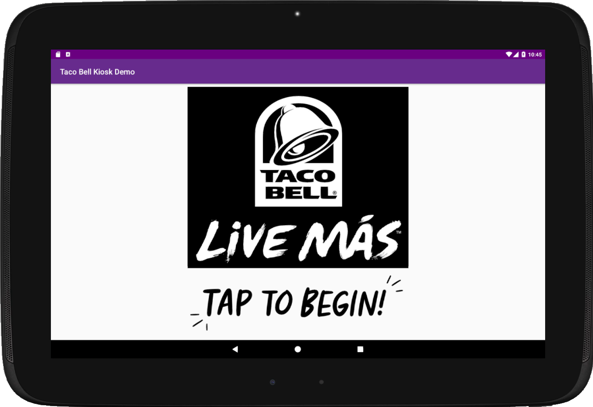
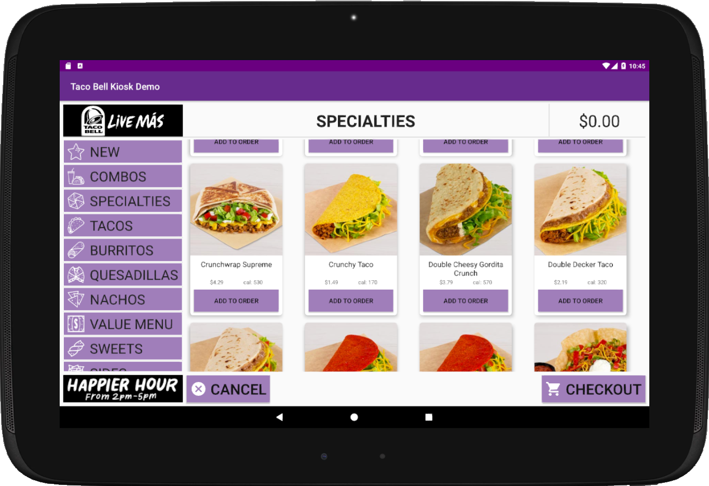
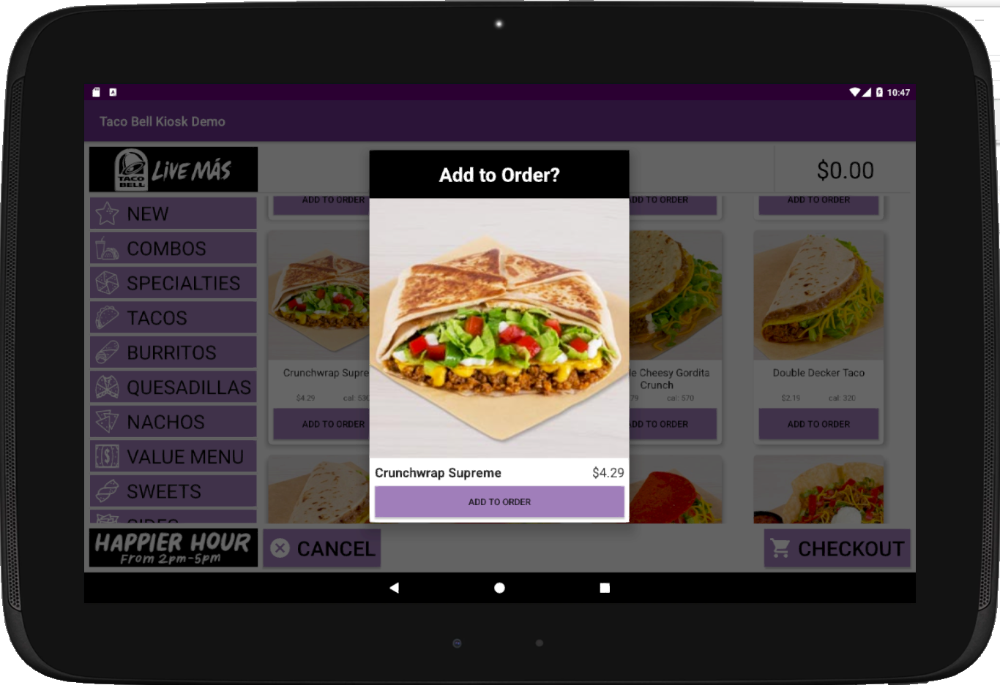
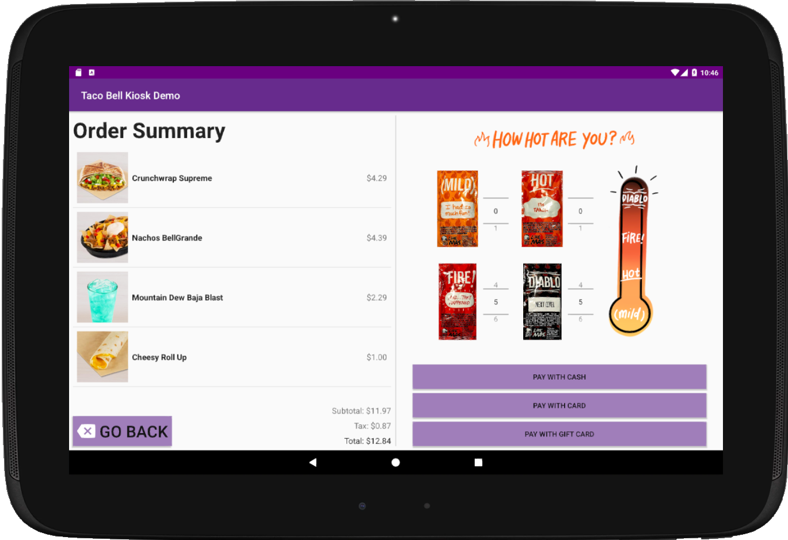

# TacoBellKioskDemo
Android Application written in Java that concepts and ordering kiosk for Taco Bell  
 
The application follows MVVM architecture  
Firebase Realtime Database is used to store menu item details and image url 
Picasso is used for image loading  
Master/Detail flow is utilized in the order screen for easy menu browsing   
Dialog Fragment is used to confirm each item addition   
Picasso is used for image loading  
Unit tests are written using JUnit and instrumented tests are written using Espresso   
The minimal amount of screens allows for a quick and easy user experience while ordering   
 
The welcome/start screen  
  
 
Browse through taco bell's enormous menu  
  
 
Good choice!  
  
 
How hot are you?  
  

Thank you for reading!  
Any suggestions will be greatly appreciated!  
